**<DateDisplay timestamp="1767451430853" />**  
_ethxzr (ethxzr, `1049816501567373383`)_
> @everyone ― **Introducing Altare 10**
> 
> Coming this month with loads of new changes:
> - New nodes, locations and a whole new panel experience
> - A new, more stable console with a better economy and loads of new services & features, now powered by Heliactyl Next 16
> - A whole new experience for Arc Code, powered by the new Arc 5.1 family
> - Full integration of Arc across our platform, with a new Arc Chat platform, now with web search, tools, our new Hyperbola 2 image/video model
> 
> ⚠️ Our economy and **all servers** will be reset. Please ensure you have backed up your data by 7 Jan 2026
> 

**<DateDisplay timestamp="1767571175046" />**  
_ethxzr (ethxzr, `1049816501567373383`)_
> 
> 

**<DateDisplay timestamp="1767573270575" />**  
_ethxzr (ethxzr, `1049816501567373383`)_
> 
> 

**<DateDisplay timestamp="1767625962252" />**  
_ethxzr (ethxzr, `1049816501567373383`)_
> @atermx (atermx, `735227932368306257`) i just drew altare in the snow mate
> 

**<DateDisplay timestamp="1767625991922" />**  
_samm9400 (samm9400, `673662795077648424`)_
> looks awful x
> 

**<DateDisplay timestamp="1767626023992" />**  
_ethxzr (ethxzr, `1049816501567373383`)_
> i'm not da vanci mate
> 

**<DateDisplay timestamp="1767627370948" />**  
_ethxzr (ethxzr, `1049816501567373383`)_
> @everyone hello people we haven't done this in a long time but https://forms.gle/QK8UkwBWxusUsCsm7
> 
> primarily due to the lack of any team nowadays, please make sure to fill in the last question as it is a factor for if you will be at Altare or one of our other "ventures"
> 

**<DateDisplay timestamp="1769198561801" />**  
_Ether (ethpr, `1049816501567373383`)_
> @here we’re clearing things up in preparation for new Altare
> 

**<DateDisplay timestamp="1769198747000" />**  
_Ether (ethpr, `1049816501567373383`)_
> praise our lord and savior hat
> 
> 

**<DateDisplay timestamp="1769198794762" />**  
_Ether (ethpr, `1049816501567373383`)_
> I will not be available much unfortunately you may all refer to the others for information as they are more likely to have it 
> 
> thank you
> 

**<DateDisplay timestamp="1769292105870" />**  
_Ether (ethpr, `1049816501567373383`)_
> @everyone introducing the new altare logo
> 
> 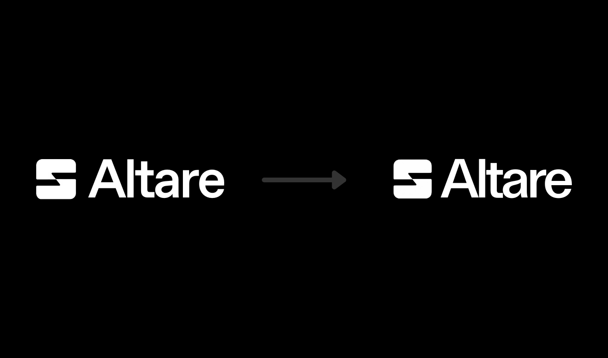
> 

**<DateDisplay timestamp="1769292469305" />**  
_Ether (ethpr, `1049816501567373383`)_
> The new NA1 logo:
> 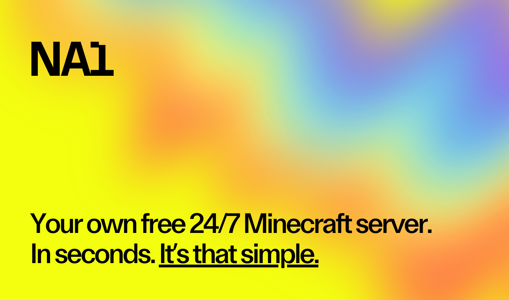
> 

**<DateDisplay timestamp="1769292716720" />**  
_Ether (ethpr, `1049816501567373383`)_
> It also now simply uses the 1 from NA1's logo in settings where only the logomark is needed
> 

**<DateDisplay timestamp="1769363454194" />**  
_Ether (ethpr, `1049816501567373383`)_
> @everyone
> 
> We've built a multithreaded JS-like language that's a bit lower level, significantly faster and more built for the backend - rather than in your browser
> 
> It uses Bunker, our extremely lightweight and fast package manager
> 
> Not much else to say about it but v0.1 will release next week with full documentation plus Bunker. We would like to launch it with all of the necessary packages to build a basic API, HTTP server, SQLite/PostgreSQL support, fetch API, streams, FFI, YAML/JSON, so on. That is our goal
> 
> 

**<DateDisplay timestamp="1769363493477" />**  
_Ether (ethpr, `1049816501567373383`)_
> I don't think many people would use this but we would like to build all of our own things in MS, so we'll add whatever we actually need to it
> 

**<DateDisplay timestamp="1769363591158" />**  
_Ether (ethpr, `1049816501567373383`)_
> In the future, there will be TMS / a typed version, and some sort of TS/JS \<> MS compiler but we are far off from that
> 

**<DateDisplay timestamp="1769408762535" />**  
_Ether (ethpr, `1049816501567373383`)_
> @everyone We have brought on a new team, acquired necessary funds and hardware 
> 
> Altare 10 will exist no matter what it takes. The current issue we are having is that Heliactyl (Altare’s dashboard) currently uses 1.5GB RAM and a CPU core for every user logged in. Naturally, if we anticipate 30,000 people actively trying to use it, it poses quite an issue 
> 
> We are fixing things and will have a new release date soon
> 

**<DateDisplay timestamp="1769408826229" />**  
_Ether (ethpr, `1049816501567373383`)_
> The latest Heliactyl is significantly heavier than last generation and is even more difficult to deploy in production. Currently, we only have a fleet of 10x 1.5TB RAM 128-core EPYC servers to serve the dashboard
> 

**<DateDisplay timestamp="1769617747111" />**  
_Ether (ethpr, `1049816501567373383`)_
> @everyone Altare 8 is going down shortly to prepare for the imminent release of Altare 10
> 
> You all had about a month to back up files, which should be sufficient
> 

**<DateDisplay timestamp="1769710605236" />**  
_Ether (ethpr, `1049816501567373383`)_
> arc, launch na1
> 

**<DateDisplay timestamp="1769710605536" />**  
_Mari (Mari, `1284881554652266677`)_
> Registration has been turned on, and the panel is now in production mode.
> 

**<DateDisplay timestamp="1769710618561" />**  
_Ether (ethpr, `1049816501567373383`)_
> @everyone
> 
> **NA1 now available again**
> 
> The first step to Altare 10 is here. NA1 uses a custom panel based on Pterodactyl which some people are more familiar with. Learn more via #information (`1340358834274701414`) - you can get the NA1 role there to access it's channels
> 
> 8GB RAM for free and a Singapore location
> 
> For questions, please refer to NA1's team / any people with the yellow role
> 
> https://na1.host
> 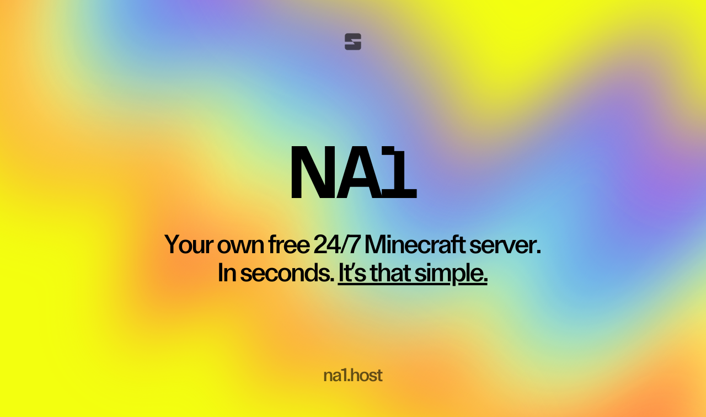
> 

**<DateDisplay timestamp="1769710692764" />**  
_Ether (ethpr, `1049816501567373383`)_
> NA1 only supports Minecraft and a few other games. For Discord bots, Hytale, etc and more locations then please wait for Altare. thank you (:
> 

**<DateDisplay timestamp="1769711252915" />**  
_Ether (ethpr, `1049816501567373383`)_
> \<:altr_arrowup:1466152455556305162> A reminder: **do not use NA1's livechat to send us pointless messages and videos**. We get a notification every time someone sends a message and it's annoying
> 

**<DateDisplay timestamp="1769725413785" />**  
_Ether (ethpr, `1049816501567373383`)_
> \<:altr_warning:1466153194269708358> **Altare 8 is now in maintenance.** We are moving over to Altare 10 and will have things back up soon.
> 

**<DateDisplay timestamp="1769725836680" />**  
_Ether (ethpr, `1049816501567373383`)_
> # If you are here from console.altr.cc redirecting to this Discord, please read ^^
> 

**<DateDisplay timestamp="1770150731665" />**  
_Ether (ethpr, `1049816501567373383`)_
> Thank you for 19,000 members 🎉
> 

**<DateDisplay timestamp="1770174754630" />**  
_Ether (ethpr, `1049816501567373383`)_
> @everyone 
> 
> Since you are being very well behaved scoundrels, I have a nice Valentine’s Day gift to all of you: the entirety of Altare
> 
> As many may know, we have a lot more to offer besides just NA1. We have been developing Altare 10 for quite a long time now 
> 
> We will be demoing each segment of products in their almost complete versions 
> 
> Events, all at 16:00 GMT:
> - **14th Feb**: 
>   - Altare 10 - our whole heavily upgraded host & whatever you’d call it, software company thing, that has been in development for months
>   - Heliactyl Next 16, Core 16 - Our brand new dashboard and panel software powering the Altare console, both named Palo Alto
>   - Talos by Altare - our new economy network and wallet that will power a new unified currency between our brands 
> 
> - **15th Feb**:
>   - GitForge, GitForge Workers, MultiScript + Bunker - Explains itself mostly, GitForge is our GitHub alternative, Workers is like Actions, MS is our new language, Bunker is our package manager 
>   - NA1 v3 - A preview of the next generation of NA1’s panel that is coming soon (no data/coins/resources reset fyi)
>   - Altare Arc 5.3 family, Arc Code 2 - Our new family of LLMs and the new Arc Chat, now with Arc Image 1. Plus our brand new vibe coding CLI
> 
> - **16th Feb**:
>   - Aztec by Altare - our new paid server hosting, VMs and metal provider
>   - Altare KV1, DB1 & AI Gateway - all of our other new developer things including our managed databases 
>   - Altare Agents - something very special, it’s basically your own clawbot/moltbot (Google it if you don’t know what this is), but hosted by Altare for free and it has it’s own permanent free workstation. It’s basically your own personal assistant that you can talk to on WhatsApp, Discord, etc and ask it to do things for you, powered internally by Arc Code 2 
>   - 2 other things that I won’t spoil 
> 
> It will be streamed in VC here in Altare’s Discord, or on our YouTube. We will upload videos of them if any of you aren’t around to watch it. I anticipate no delays to these events as I’ve already started editing the parts that won’t be live
> 

**<DateDisplay timestamp="1770175119133" />**  
_Ether (ethpr, `1049816501567373383`)_
> To clarify, all of the things shown to you all during this will indeed release considerably soon after. Figure out the actual Altare 10 release date based on that
> 

**<DateDisplay timestamp="1770179097434" />**  
_Ciph (valex.cloud, `875373207895572530`)_
> Yea panel is fixed, crucible was the root cause. Altare & NA1 shall use Elysia Aerix from now on, as that has been proven to be stable in mass production senarios.
> 

**<DateDisplay timestamp="1770226839030" />**  
_Ether (ethpr, `1049816501567373383`)_
> Hi @everyone 
> 
> We are currently experiencing a widespread outage of Altare’s Singapore location 
> 
> VPS/VM and metal customers will be provided credit, a partial refund or additional time on their plan 
> 
> This also affects NA1 alongside the unrelated drive failure earlier 
> 
> We will have an ETA on things returning to normal soon
> 

**<DateDisplay timestamp="1770297158035" />**  
_dan (previews, `136187150457765888`)_
> Please avoid pinging staff in tickets -- if done, you will be given a 24 hour mute
> 

**<DateDisplay timestamp="1770319152139" />**  
_Ether (ethpr, `1049816501567373383`)_
> Hi @everyone
> 
> Would you all agree with a complete split of NA1 from Altare? It would gain it's own legal entity, team and control over operations, and Altare would withdraw it's infrastructure and software
> 
> I have had quite a few people suggesting this
> 

**<DateDisplay timestamp="1770319227080" />**  
_Ether (ethpr, `1049816501567373383`)_
> This would mean NA1 would need to fund it's own nodes likely through ads or paid plans, and it would need to find a new development team as Altare would no longer provide either
> 

**<DateDisplay timestamp="1770319721310" />**  
_Ether (ethpr, `1049816501567373383`)_
> Please provide your opinions on this in #general (`1465562005455769671`) / \<#1466151602476945529> as well, if you prefer NA1 relying on Altare or if it should be self sufficient
> 

**<DateDisplay timestamp="1770389801070" />**  
_Ether (ethpr, `1049816501567373383`)_
> @here Huge update coming to NA1 soon
> 

**<DateDisplay timestamp="1770433731276" />**  
_Ether (ethpr, `1049816501567373383`)_
> @everyone
> 
> Just a random poll. Please answer it as we need the data ^
> Big update is coming to NA1 soon which will fix everything
> 

**<DateDisplay timestamp="1770433773627" />**  
_Ether (ethpr, `1049816501567373383`)_
> If any of you are Altare VM/metal customers please know I will respond in the morning I have over 100 DMs to read
> 

**<DateDisplay timestamp="1770511163894" />**  
_Ether (ethpr, `1049816501567373383`)_
> @here Currently I have some form of flu and for whatever reason it's completely demolished me
> 
> It also seems that paracetamol is only working for about an hour, I'm genuinely too weak to do anything. For the what is now 220+ DMs I will respond when I can please give me a while
> 
> I'll try and fix NA1 soon as well
> 

**<DateDisplay timestamp="1770555983080" />**  
_Ether (ethpr, `1049816501567373383`)_
> @here I’m fixing gb-lon01 shortly I have to sort out the drives again… like sg-sgp01 before it failed and I have the feeling something will go wrong 
> 
> Do you all want some temporary nodes for a month or two in Frankfurt, DE and the US until we have larger replacements? Probably 256GB RAM. We would move all of your server data for you once larger nodes are available 
> 
> We’re trying our hardest to get a new Singapore node online, but it may take a little while as the original sg-sgp01 hasn’t been sorted out and had new drives installed yet
> 

**<DateDisplay timestamp="1770569286819" />**  
_Ether (ethpr, `1049816501567373383`)_
> Maintenance now in progress for gb-lon01
> 

**<DateDisplay timestamp="1770569295045" />**  
_Ether (ethpr, `1049816501567373383`)_
> sg-sgp01 is being replaced with de-fsn01 for now
> 

**<DateDisplay timestamp="1770569659430" />**  
_Ether (ethpr, `1049816501567373383`)_
> Moving gb-lon01 data to new drives. Running 4x7T drives in RAID 4
> 

**<DateDisplay timestamp="1770574273297" />**  
_Ether (ethpr, `1049816501567373383`)_
> Things are a bit broken right now I'm working on the panel
> 

**<DateDisplay timestamp="1770580018107" />**  
_Ether (ethpr, `1049816501567373383`)_
> @everyone
> 
> NA1 has been updated. Enjoy the brand new UI and many improvements
> 
> Both Falkenstein, DE and London, GB locations are now working properly. NA1 is back to normal operations
> 

**<DateDisplay timestamp="1770580142921" />**  
_Ether (ethpr, `1049816501567373383`)_
> The coins/napoints system will be updated next to fix some bugs and issues with it
> 

**<DateDisplay timestamp="1770598927107" />**  
_Ether (ethpr, `1049816501567373383`)_
> @everyone 
> 
> **Introducing the NA1 desktop app**
> 
> We've made a really nice desktop app for NA1. It feels a lot more native, has tabs, a more desktop-suited layout and it's generally quite nice to use.
> 
> Download it via:
> https://github.com/altaresoftware/na1-apps/releases/tag/1
> 
> Under Assets find the version suited to your operating system. 
> `.exe` for Windows x86/arm64
> `.dmg` for macOS
> `.AppImage` for any Linux distro
> 
> We'll give the first 100 people to give the app a go a free 1250 coins. You can DM me with a screenshot of you having it open to claim it
> 
> The code for the app is fully open source, just look inside desktop/ of that repo
> 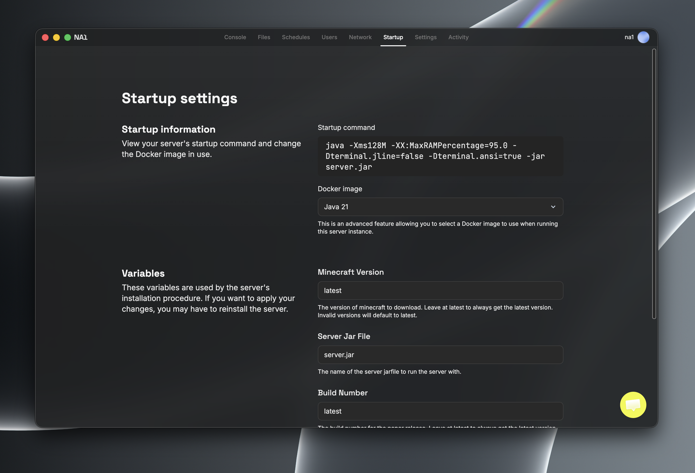
> 

**<DateDisplay timestamp="1770599171431" />**  
_Ether (ethpr, `1049816501567373383`)_
> Users on macOS may need to manually whitelist it as we are not paying £150 for a developer license ^
> 

**<DateDisplay timestamp="1770599189609" />**  
_Ether (ethpr, `1049816501567373383`)_
> Mobile app is coming next
> 

**<DateDisplay timestamp="1770599759464" />**  
_Ether (ethpr, `1049816501567373383`)_
> **This really doesn't work properly on Windows 10 right now.** We only tested it on macOS and Windows 11
> 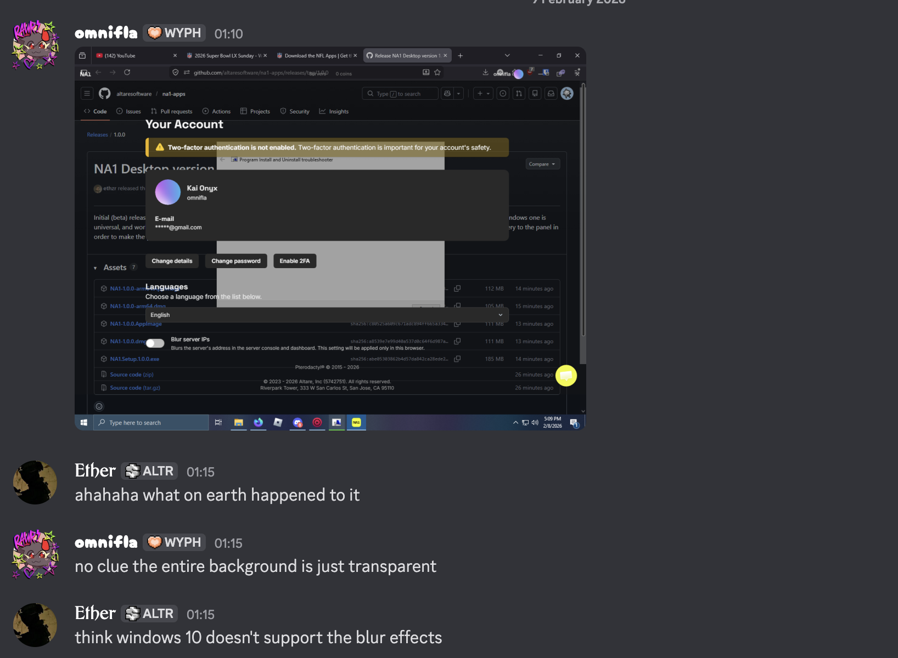
> 

**<DateDisplay timestamp="1770604994286" />**  
_Ether (ethpr, `1049816501567373383`)_
> Android & iOS now available: https://github.com/altaresoftware/na1-apps/releases/tag/1-m
> 

**<DateDisplay timestamp="1770612517383" />**  
_Ether (ethpr, `1049816501567373383`)_
> Android app doesn’t seem to install
> 

**<DateDisplay timestamp="1770649863290" />**  
_Ether (ethpr, `1049816501567373383`)_
> Android app has been updated in the release to fix the signing issues. Should install fine now
> 

**<DateDisplay timestamp="1770651813775" />**  
_Ether (ethpr, `1049816501567373383`)_
> **NA1 app version 1.1 is out**
> 
> This fixes Android signing issues, blur on Windows 10 & Linux, light mode issues on Windows 11 and adds an update checker, back/forward buttons and a few other things.
> 
> I also renamed the files in the release to make it a bit clearer
> 
> https://github.com/altaresoftware/na1-apps/releases/tag/1.1[messages/attachment_1470445026592035089.png](messages/attachment_1470445026592035089.png)
> 

**<DateDisplay timestamp="1770652071096" />**  
_Ether (ethpr, `1049816501567373383`)_
> @here ^^
> 

**<DateDisplay timestamp="1770681056605" />**  
_Ether (ethpr, `1049816501567373383`)_
> We will no longer be using altr.cc and altare.cv following Altare 10. If any of you have important subdomains or anything like that that on either domains, please DM me to tranfer to altare.sh
> 

**<DateDisplay timestamp="1770681443325" />**  
_Ether (ethpr, `1049816501567373383`)_
> All old nodes are now being turned off, plus gateway.altr.cc and colossus.altr.cc. They may temporarily redirect to colossus.altare.sh but ignore that it's not actually up
> 

**<DateDisplay timestamp="1770681468970" />**  
_Ether (ethpr, `1049816501567373383`)_
> arc.altr.cc is also going down although it's broken already. The Altare Arc 5.x API will also go down
> 

**<DateDisplay timestamp="1770685010327" />**  
_Ciph (valex.cloud, `875373207895572530`)_
> Altare now has its own ASN & IPV4 & IPV6 prefixes, those will be revealed at the launch of Altare 10
> 

**<DateDisplay timestamp="1770686118971" />**  
_Ether (ethpr, `1049816501567373383`)_
> AS215327 Altare AI LLC 👍
> 

**<DateDisplay timestamp="1770762376468" />**  
_Ether (ethpr, `1049816501567373383`)_
> @everyone We make a lot of things, not just hosting. And one part of that is Altare AI which surprisingly a lot of people use
> 
> The new Arc Chat and Arc Code is coming tomorrow, powered by the next generation Altare Arc models. We'll have another announcement for that
> 
> Everything you'd expect is here - web search, code sandboxes, deep research, voice chat, projects, image & video generation, extra thinking & more
> 

**<DateDisplay timestamp="1770762390107" />**  
_Ether (ethpr, `1049816501567373383`)_
> I'll show you all an early preview of it later
> 

**<DateDisplay timestamp="1770762440741" />**  
_Ether (ethpr, `1049816501567373383`)_
> The first 500 users will have unlimited limits of Altare's new frontier model
> 

**<DateDisplay timestamp="1770781256418" />**  
_Ether (ethpr, `1049816501567373383`)_
> whats this
> 
> 

**<DateDisplay timestamp="1770781357158" />**  
_Ether (ethpr, `1049816501567373383`)_
> who noticed the NA1 font and site changing to fit in with altare? 🤣
> 

**<DateDisplay timestamp="1770925904588" />**  
_Ether (ethpr, `1049816501567373383`)_
> @here Ten.
> 

**<DateDisplay timestamp="1770925996905" />**  
_Ether (ethpr, `1049816501567373383`)_
> things have been quiet haven't they?
> 

**<DateDisplay timestamp="1771022077094" />**  
_Ether (ethpr, `1049816501567373383`)_
> We will get everything together ASAP and launch Altare 10 tomorrow or on the 15th, powered by the full Heliactyl Next 16
> 

**<DateDisplay timestamp="1771022088118" />**  
_Ether (ethpr, `1049816501567373383`)_
> Please ignore the prior poll
> 

**<DateDisplay timestamp="1771085217272" />**  
_Ether (ethpr, `1049816501567373383`)_
> @everyone Thank you all for 20k members. The event has been cancelled since Altare 10 is so close to release anyway
> 

**<DateDisplay timestamp="1771085679396" />**  
_Ether (ethpr, `1049816501567373383`)_
> All the AI products have also received a major upgrade, it’s now powered by Arc 6 and Arc 6 Max 
> 
> 1:1 parity on most benchmarks with Claude Opus 4.6 at 2.5x the speed
> 
> As a consequence of the models being much larger we can’t offer them for free, all users will get $25 of credit on the AI platform. Arc 6 mini and Arc 6 will be free
> 

**<DateDisplay timestamp="1771086297091" />**  
_Ether (ethpr, `1049816501567373383`)_
> -
> 
> Our new models are heavily fine tuned on top of the new GLM 5. We also have a new experimental Arc 6 Heavy model which is significantly larger and much better at writing and creative work but slower and not made for code
> 

**<DateDisplay timestamp="1771086628344" />**  
_Ether (ethpr, `1049816501567373383`)_
> And everything that’s new on our hosting platform:
> 
> - New ways to earn credits 
> - A new AltPoints economy 
> - More features across server management including a new plugin & mod manager for MC servers, and the ability to change your server software 
> - A whole new panel powered by Colossus 16
> - A new UI for the console 
> 
> And there’s obviously lots more but that’s just the things on the hosting side. And new nodes too
> 

**<DateDisplay timestamp="1771168096325" />**  
_Ether (ethpr, `1049816501567373383`)_
> @here Currently, we have a considerably large shortage of infrastructure which is affecting both Altare due to lack of nodes and Altare AI due to less inference capacity 
> 
> Please give us a short amount of time to deal with this and then we can release Altare 10. We don’t want to release it with two locations and only a few nodes
> 

**<DateDisplay timestamp="1771168213561" />**  
_Ether (ethpr, `1049816501567373383`)_
> Altare AI is currently using around 95% of our machines that are available as well
> 

**<DateDisplay timestamp="1771343867122" />**  
_Ether (ethpr, `1049816501567373383`)_
> @everyone Apologies for the delays, we have been unable to source enough infrastructure
> 
> At this time it is currently unlikely for Altare to launch with a Singapore location, at least available to all users. We will likely have strict capacity limits and lock it to Altare X which will be a plan that is 1500 credits/mo (which you can earn for free though)
> 
> I have several calls/meetings this week with providers to try and get more machines as soon as possible
> 
> It turns out it is extremely difficult to do what we're trying to do with such a small team. So we are likely to launch Altare 10 in components, with the hosting coming first as that's what most people are waiting for. Then Arc and all our other things
> 

**<DateDisplay timestamp="1771344079048" />**  
_Ether (ethpr, `1049816501567373383`)_
> At the same time we are also developing a ridiculous amount of software: Heliactyl Next 16, Radar 16, Cryogenic 16, Colossus 16, Colossus 16 for NA1 (legacy), NA1's new panel & daemon, Terra 16, Arc Code 2 & IDE, Arc 6.x models, Arc nano models, Arc Chat, Altare AI Gateway, MS & Bunker, so on. It has taken several months to get all of this into a somewhat ready state
> 

**<DateDisplay timestamp="1771423401751" />**  
_Ether (ethpr, `1049816501567373383`)_
> @here We are now much closer to Altare being available, we have acquired plenty of hardware in EU and US. While it's not Asia, it's at least enough to handle demand
> 

**<DateDisplay timestamp="1771423441963" />**  
_Ether (ethpr, `1049816501567373383`)_
> Our NYC and Dallas locations will also be powered by Altare-owned infrastructure and using our AS215327 network
> 

**<DateDisplay timestamp="1771423601392" />**  
_Ether (ethpr, `1049816501567373383`)_
> We do have enough capacity in SG that it will be available for free, but it will use Arm based CPUs
> 

**<DateDisplay timestamp="1771449244893" />**  
_Ether (ethpr, `1049816501567373383`)_
> @everyone Say hello to Altare 10. Coming 20 Feb, 14:00 BST. It's finally here, no more delays
> 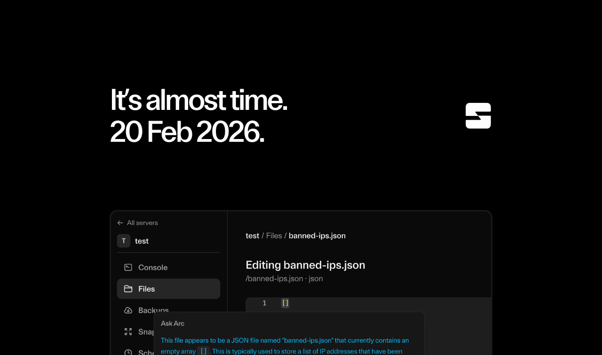
> 

**<DateDisplay timestamp="1771449313948" />**  
_Ether (ethpr, `1049816501567373383`)_
> I promise you've all never experienced such a smooth and responsive UI on Altare before
> 
> 

**<DateDisplay timestamp="1771510857164" />**  
_Ether (ethpr, `1049816501567373383`)_
> @here Here's the first feature we're showing a preview of - **VMs**
> 
> Create your own free workstation powered by either Windows or macOS, completely for free. You only need to pay 799 credits/mo for the starter plan with 8GB RAM and 4 vCPUs 
> 
> Performance and latency is excellent no matter where you are, thanks to all of our nodes and VM hypervisors now being powered by Altare's network (AS215327)
> 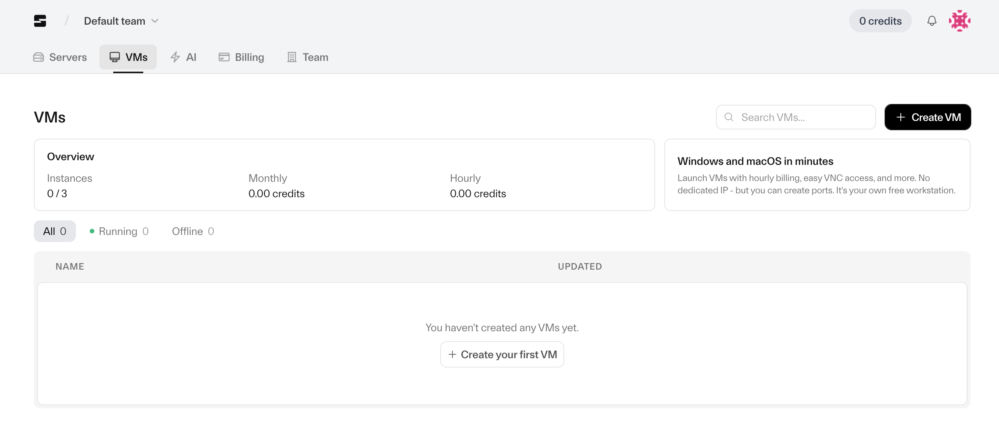
> 

**<DateDisplay timestamp="1771528749085" />**  
_Ether (ethpr, `1049816501567373383`)_
> You'll all be happy to know Altare 10 is on schedule for the release date I mentioned
> 

**<DateDisplay timestamp="1771563614719" />**  
_Ether (ethpr, `1049816501567373383`)_
> Please note that ahead of Altare 10's launch, Altare AI has been given independence from Altare
> 
> Altare Axiom (our AI platform) will remain part of the Altare Console for the forseeable future
> 

**<DateDisplay timestamp="1771613190657" />**  
_Ether (ethpr, `1049816501567373383`)_
> @everyone We have essentially deployed Altare but it is currently disabled for the public until tomorrow
> 
> This is so we can have a beta testing round internally, several major issues were found during testing today, we had skipped the entire beta testing process to get this out as soon as possible. Heliactyl (the software that powers the dashboard) currently only has around 20% test coverage, so manual testing is necessary. We would like to get this up to 100% after release 
> 
> Tomorrow, same time (14:00 BST). This time it will happen because we literally just need to enable access
> 

**<DateDisplay timestamp="1771613712096" />**  
_Ether (ethpr, `1049816501567373383`)_
> Heliactyl Next 16 / Palo Alto was meant to implement mutation testing and a much more stable codebase since 15 was only an interim version to replace the disastrous prior dashboard 
> 
> However, personal circumstances and Altare’s overall product lineup getting more complex meant 16 only began development 3 days ago
> 
> That might tell you a bit more about how fast we are moving now. Altare 10 did not exist 4 days ago. Now we have completely implemented the whole update
> 
> We made this possible thanks to our whole team’s focus being put on Altare, and significantly more intelligent Arc Code to make things 10x faster
> 

**<DateDisplay timestamp="1771695581559" />**  
_Ether (ethpr, `1049816501567373383`)_
> @everyone https://www.youtube.com/watch?v=KvR3h71trtg \<t:1771700400:f>
> 

**<DateDisplay timestamp="1771700048966" />**  
_Ether (ethpr, `1049816501567373383`)_
> Live in 5 minutes ^ @here
> 

**<DateDisplay timestamp="1771700107085" />**  
_Ether (ethpr, `1049816501567373383`)_
> Please note that our London location is temporarily unavailable for the next hour or two due to issues with the node
> 

**<DateDisplay timestamp="1771700743419" />**  
_Ether (ethpr, `1049816501567373383`)_
> Fixing the bug with auth
> 

**<DateDisplay timestamp="1771700895472" />**  
_Ether (ethpr, `1049816501567373383`)_
> Fixed, VM's disk space filled itself
> 

**<DateDisplay timestamp="1771701765613" />**  
_Ether (ethpr, `1049816501567373383`)_
> Fixed loading bug
> 

**<DateDisplay timestamp="1771716934695" />**  
_Ether (ethpr, `1049816501567373383`)_
> I am making some changes to our management
> 
> @Heisenberg (heisenbzrg, `258262924986941440`) will be appointed CEO of Altare, @Brewed (brewed_sys, `760438064971251753`) as CEO of Altare AI and @tom.m7 (tom.m7, `1230563250752458753`) as COO
> Expect more updates from others in our team and more progress, likely a huge amount of bug fixes and improvements soon, plus possibly more staff
> 

**<DateDisplay timestamp="1771737464520" />**  
_Brewed (brewed_sys, `760438064971251753`)_
> The launch date for Altare's Arc Chat is officially set! Featuring the Arc 6 series alongside powerful models like GPT-OSS, Llama 4, Qwen 3, and Kimi 2—all optimized for blazing-fast speeds—the release is happening on February 23, 2026.
> 

**<DateDisplay timestamp="1771738762647" />**  
_Brewed (brewed_sys, `760438064971251753`)_
> our next major focus will be remaking the Heliactyl Dashboard.
> 

**<DateDisplay timestamp="1771768662001" />**  
_sam (samm9400, `673662795077648424`)_
> We're aware of all current issues and are actively working on a resolution. We thank you for your patience.
> 

**<DateDisplay timestamp="1771772473757" />**  
_Ether (ethpr, `1049816501567373383`)_
> Hi @here
> 
> All issues should be fixed. We will try and ensure everything remains stable from now on. The panel VM's disk space had completely filled itself, which caused the panel to go down and I'm the only one with access
> 

**<DateDisplay timestamp="1771772627513" />**  
_Ether (ethpr, `1049816501567373383`)_
> Our plans over the next week or two are:
> - Increase default resources once new capacity has been deployed
> - Add more ways to earn credits
> - Improve performance and stability on the console, add more features like a plugin manager, so on
> - Improve the AI platform, fix all the bugs, relaunch Arc Code
> - Lots more
> 

**<DateDisplay timestamp="1771773311347" />**  
_Ether (ethpr, `1049816501567373383`)_
> We are doing a mass investigation on economy abuse. Any user who has taken part in it will be permanently banned from Altare
> 
> Alongside this, we will be turning on Discord account verification again and locking down referrals
> 

**<DateDisplay timestamp="1771774487935" />**  
_Ether (ethpr, `1049816501567373383`)_
> Over 100 transactions have been reverted and 11 users have been banned. If you willingly took abused credits and spent them, enjoy your minus balance which will result in account deactivation within 7 days if not paid back
> 

**<DateDisplay timestamp="1771776374654" />**  
_Ether (ethpr, `1049816501567373383`)_
> Deployed many bug fixes and improvements. We are out of capacity in Singapore and performance is suffering there. We will deploy 4 more nodes and fix it very shortly. Currently fixing issues with Workstations
> 

**<DateDisplay timestamp="1771779892928" />**  
_Ether (ethpr, `1049816501567373383`)_
> Rebooting sg-sgp01 and sg-sgp02 to fix issues
> 

**<DateDisplay timestamp="1771780215684" />**  
_Wesley S (wesleyschokker, `1066059824346955886`)_
> Tickets are working again.
> 

**<DateDisplay timestamp="1771806360832" />**  
_Heisenberg (heisenbzrg, `258262924986941440`)_
> @everyone 
> 
> **Some small updates to Altare**
> 
> - Significantly more capacity is now available in Singapore 🇸🇬
> - Our new internal AI bot is now available. If we have an outage, use #status (`1466109016823435488`) to report it in case it doesn't pick it up from reading the community channels. Then the AI will automatically delegate a task, investigate it and fix it and post status updates. This is in case any of our team are offline
> - 15+ new software types are available including Bun, Node.js, Python and Minecraft Bedrock, Hytale, and more
> - Billing is now available, you can buy credits
> - Big improvements to anti-abuse on the economy
> - Many performance fixes, and many bug fixes across our platform
> 
> https://altare.sh
> 

**<DateDisplay timestamp="1771829359809" />**  
_Ether (ethpr, `1049816501567373383`)_
> @everyone
> 
> gb-lon02 is now available, it's powered by our own network and infrastructure from Altare which is why it's significant
> 
> Altare Object Storage and KV1 is now available as promised. You're welcome to give our shockingly fast database service a go. There may be bugs on the UI side temporarily. We are also working on a documentation site for the AI API, Object Storage and KV1
> 
> For now, here's the openapi.json for them. Workstations/VMs will be fixed soon I'm going to bed it's 6 am and I haven't slept
> 
> 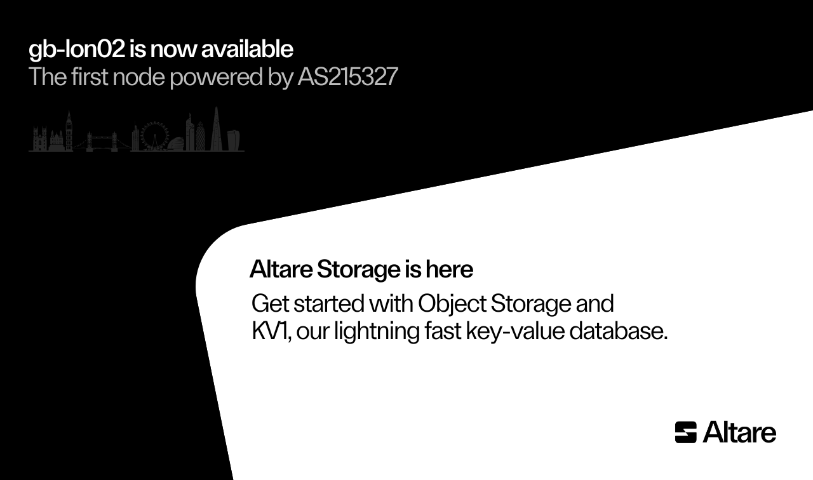
> 

**<DateDisplay timestamp="1771854072184" />**  
_tom.m7 (tom.m7, `1230563250752458753`)_
> We are aware of the SFTP issue.
> 

**<DateDisplay timestamp="1771862349525" />**  
_Ether (ethpr, `1049816501567373383`)_
> Fixed
> 

**<DateDisplay timestamp="1771862423677" />**  
_Ether (ethpr, `1049816501567373383`)_
> Access key creation has been fixed for S3/KV1
> 

**<DateDisplay timestamp="1771885252334" />**  
_Ether (ethpr, `1049816501567373383`)_
> Maintenance on gb-lon02. The IP for the node will change
> 

**<DateDisplay timestamp="1771887223803" />**  
_Ether (ethpr, `1049816501567373383`)_
> Altare's global edge network is now here, available in over 40 major cities
> 
> We will be using this to power the new Altare Pages and Altare Fabric services
> 

**<DateDisplay timestamp="1771889554124" />**  
_Brewed (brewed_sys, `760438064971251753`)_
> Arc Chat is releasing sooner than you expect! I'm just doing a final check of the backend, and then it will be ready to launch.
> 

**<DateDisplay timestamp="1771911204299" />**  
_Brewed (brewed_sys, `760438064971251753`)_
> Release delayed for tmr, had some issues.
> 

**<DateDisplay timestamp="1771913616888" />**  
_Ether (ethpr, `1049816501567373383`)_
> @here
> 
> **Maintenance on all nodes**
> 
> There will potentially be up to a 15 minute maintenance where nodes are inaccessible. You may also need to refresh your DNS cache so that you pick up the new node IPs if connecting to servers
> 
> We are performing a full network switchover to Altare / AS215327, powered by our edge network. Latency will be significantly better
> 
> Shortly after, some new nodes will also be available powered by Altare owned infrastructure. We'll let everyone know when the maintenance is over and things are sorted
> 

**<DateDisplay timestamp="1771917782301" />**  
_Ether (ethpr, `1049816501567373383`)_
> All maintenance complete
> 

**<DateDisplay timestamp="1771918468203" />**  
_Ether (ethpr, `1049816501567373383`)_
> Fixing inbound connectivity to servers
> 

**<DateDisplay timestamp="1771920889002" />**  
_Ether (ethpr, `1049816501567373383`)_
> Fixed
> 

**<DateDisplay timestamp="1771941158365" />**  
_Wesley S (wesleyschokker, `1066059824346955886`)_
> @everyone 
> 
> Hello there,
> 
> We will add around 8 new servers in around 2 hours. 
> 
> Below here you will see a overview of new servers being added:
> 
> **-** ``Singapore 3x``
> **-** ``Germany 5x``
> 
> Stay tuned!
> 
> React with a ❤️ and i will work to add them faster!
> 

**<DateDisplay timestamp="1771944357214" />**  
_Ether (ethpr, `1049816501567373383`)_
> Working on fixing performance issues across our machines
> 

**<DateDisplay timestamp="1771948690840" />**  
_Wesley S (wesleyschokker, `1066059824346955886`)_
> We will host a giveaway when we added the 8 new nodes!
> 

**<DateDisplay timestamp="1771958118506" />**  
_Wesley S (wesleyschokker, `1066059824346955886`)_
> @everyone  (sorry for the tag)
> 
> @JulianRJC (julianrjc, `1369710606319489096`) gives away 2.5K credits at Altare! @mention him in the #general (`1465562005455769671`) chat and say why you want to win the 10K credits. There will be 5  winners
> 
> Winner will be choosed in 10 minutes.
> 
> (This is the giveaway for the new servers, so have fu)
> 

**<DateDisplay timestamp="1771958486965" />**  
_Wesley S (wesleyschokker, `1066059824346955886`)_
> 5 MINUTESS LEFT! MENTION @JulianRJC (julianrjc, `1369710606319489096`) IN #general (`1465562005455769671`)
> 

**<DateDisplay timestamp="1771958800059" />**  
_JulianRJC (julianrjc, `1369710606319489096`)_
> TIME IS OVER!!!!!!! Selecting NOWW!!
> 

**<DateDisplay timestamp="1771958898815" />**  
_JulianRJC (julianrjc, `1369710606319489096`)_
> @KINGSIPU (sipukingop., `1345329283454861342`) YOUR THE WINNNERRRRRRRRRRRR!!! Create a ticket to claim your credits and tag @Wesley S (wesleyschokker, `1066059824346955886`)[messages/attachment_1475927337303543838.png](messages/attachment_1475927337303543838.png)
> 

**<DateDisplay timestamp="1771959068334" />**  
_JulianRJC (julianrjc, `1369710606319489096`)_
> WE ARE GOING TO DO ANOTHER ROUNDD!!!!! DONT TAG ME!! THE WHEEL IS READYYYY
> 

**<DateDisplay timestamp="1771959121829" />**  
_JulianRJC (julianrjc, `1369710606319489096`)_
> SECOND WINNNNERRR ISSSS!!! @Wobbie (wobbie0862_64759, `1179474294670118935`)
> 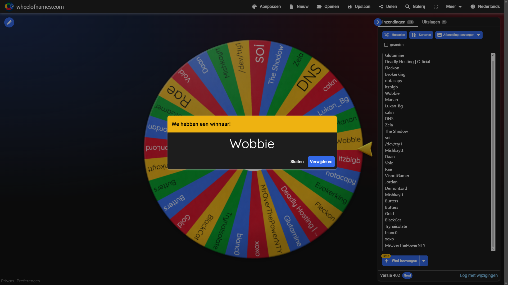
> 

**<DateDisplay timestamp="1771959149279" />**  
_JulianRJC (julianrjc, `1369710606319489096`)_
> ARE YOU GUYSS READY FOR A THIRDDDD ROUNNDDDDDDDD!!
> 

**<DateDisplay timestamp="1771959259490" />**  
_JulianRJC (julianrjc, `1369710606319489096`)_
> THE LASSTTTT WINNERRR ISSSSSS @Void (ultimatedev0, `1219188988636823653`) 
> 
> Please create a #tickets (`1466108983734567180`)
> 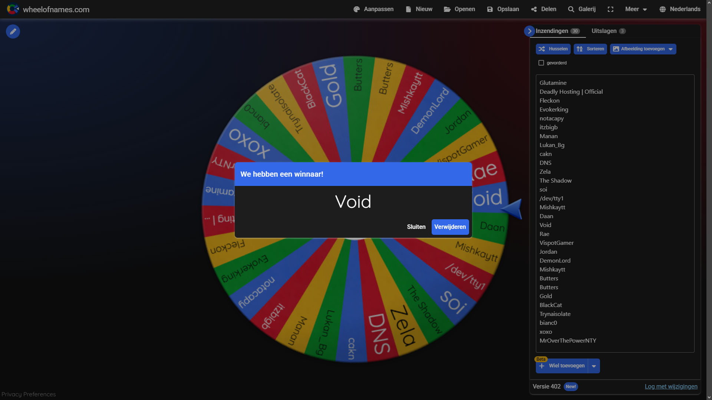
> 

**<DateDisplay timestamp="1771959383128" />**  
_JulianRJC (julianrjc, `1369710606319489096`)_
> Boys, are we hyped for a 4th rounddd!!!!!!!! Create a ❤️ chain for @Wesley S (wesleyschokker, `1066059824346955886`) and MENTION HIMMM!!! Get the spam going!!
> 

**<DateDisplay timestamp="1771959590920" />**  
_JulianRJC (julianrjc, `1369710606319489096`)_
> THE 4TH AND LAST WINNNERRRR ISSSS @DNS (dns.was.taken, `911506744197398549`) 
> 
> Please create a ticket!!
> 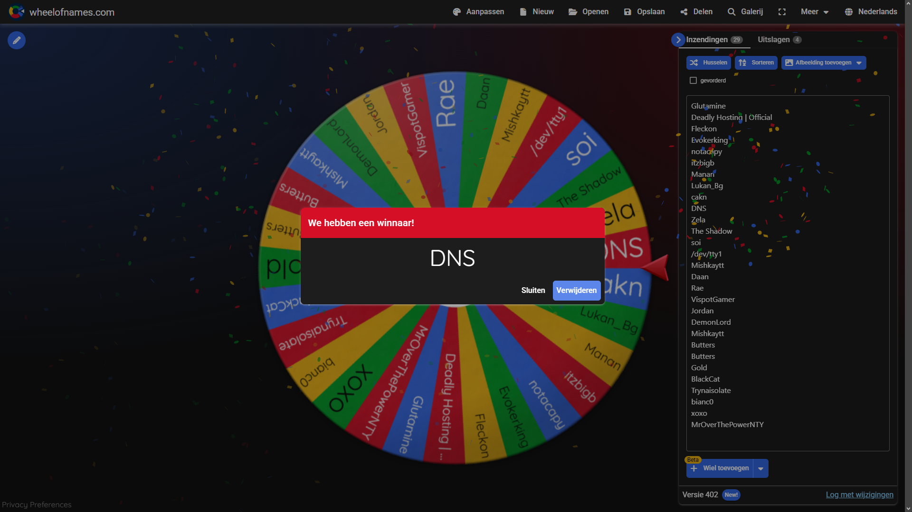
> 

**<DateDisplay timestamp="1771959608396" />**  
_Wesley S (wesleyschokker, `1066059824346955886`)_
> This was the last giveaway
> 

**<DateDisplay timestamp="1771959620570" />**  
_Wesley S (wesleyschokker, `1066059824346955886`)_
> Thank you for partipicating
> 

**<DateDisplay timestamp="1771959632129" />**  
_Wesley S (wesleyschokker, `1066059824346955886`)_
> Make a ticket to claim your price
> 

**<DateDisplay timestamp="1771960197414" />**  
_Ether (ethpr, `1049816501567373383`)_
> We are now deploying new nodes and performing some maintenance on the overloaded existing nodes
> 
> Users may experience a short downtime. We're also looking into improving latency on Singapore as some people have been reporting high latency in this location
> 
> Performance should be sorted very soon. We are also deploying many new nodes tonight
> 

**<DateDisplay timestamp="1772021088354" />**  
_sam (samm9400, `673662795077648424`)_
> # ⚠️ Just to set the record...
> 
> Any coins that have been earned via a bug, glitch, or transferred from a malicious account will result in your coins being reset to **0**, unless otherwise approved by an administrator. *This does not apply if it was you who discovered the bug.*
> 
> If you have found a bug, report it in #bug-reports (`1475156714096689182`)
> 

**<DateDisplay timestamp="1772036913165" />**  
_Ether (ethpr, `1049816501567373383`)_
> We're performing some maintenance on nodes to get performance back to acceptable levels. There may be a short amount of downtime
> 
> sg-sgp04 and de-fsn01 are being deployed as well, alongside jp-osa01 and jp-osa02
> 

**<DateDisplay timestamp="1772037444237" />**  
_Ether (ethpr, `1049816501567373383`)_
> @here We are performing maintenance on the Workstations platform, us-central1 (workstations) and us-ash01 (hosting) to fix drive issues and fix Workstation deployment
> 
> We are also performing maintenance on gb-lon01 to increase the disk space to use all drives, as it is full and preventing servers from functioning
> 
> ETA is \<35 minutes
> 

**<DateDisplay timestamp="1772037529641" />**  
_Ether (ethpr, `1049816501567373383`)_
> Altare Object Storage may temporarily be unavailable (5-10 minutes)
> 

**<DateDisplay timestamp="1772038605020" />**  
_Ether (ethpr, `1049816501567373383`)_
> gb-lon01 is back online. All servers have been automatically restarted
> 

**<DateDisplay timestamp="1772038951289" />**  
_Ether (ethpr, `1049816501567373383`)_
> Waiting on data to move over on us-central1 (workstations)
> 

**<DateDisplay timestamp="1772053784558" />**  
_Brewed (brewed_sys, `760438064971251753`)_
> Altare’s Arc Chat Launching Soon!
> 

**<DateDisplay timestamp="1772054375039" />**  
_Ether (ethpr, `1049816501567373383`)_
> All node issues resolved. You may need to wait until your DNS cache updates
> 

**<DateDisplay timestamp="1772057294420" />**  
_Brewed (brewed_sys, `760438064971251753`)_
> @everyone @here
> Arc Chat powered by Altare is now live with a stacked model list featuring Llama 3.3 70B, Llama 3.1 8B, Llama 4 Maverick, Llama 4 Scout, GPT-OSS 120B, GPT-OSS 20B, Kimi K2, and Qwen3 32B. So whether you're in the market for a light assistant or a heavy-hitter in reasoning capabilities, we have it all in one place. Each user has personal rate limits across all the models to ensure our platform remains fast, stable, and abuse-free. So if you ever hit a limit, just wait until it resets and you're good to go! Give it a try now at https://chat.altare.sh/app and check out more at https://altare.sh. 
> 
> If you encounter any bugs or something doesn’t quite work the way you expect it to, please let us know with a quick report. What you were trying to do, what happened, and any screenshots you might have will all be helpful in fixing the issue sooner.
> 
> Arc Chat is off to a great start with 6 core models available today, but this is just the beginning. More models and some very exciting new features will be coming out this week, so check back often!
> 

**<DateDisplay timestamp="1772058024252" />**  
_Ether (ethpr, `1049816501567373383`)_
> Altare's own Arc models will be available on it soon ^
> 

**<DateDisplay timestamp="1772058049807" />**  
_Brewed (brewed_sys, `760438064971251753`)_
> ~~There is a Small Rendering issue with Maths Question / Equations. It will be fixed soon.~~
> 

**<DateDisplay timestamp="1772058515977" />**  
_Brewed (brewed_sys, `760438064971251753`)_
> Fixed the Rendering Issue with Maths Question / Equations.
> 

**<DateDisplay timestamp="1772068513323" />**  
_Brewed (brewed_sys, `760438064971251753`)_
> Altare has acquired a new domain altare.site. Someone new is coming soon.
> 

**<DateDisplay timestamp="1772082661571" />**  
_Brewed (brewed_sys, `760438064971251753`)_
> @everyone
> 
> Altare has Launched First Product on Builtbybit: https://builtbybit.com/resources/phantom-modern-game-server-dashboard.94542/
> 
> if you like the product support it. thanks
> 

**<DateDisplay timestamp="1772120307998" />**  
_Ether (ethpr, `1049816501567373383`)_
> @here There will be a major refactor pushed to our dashboard today, and all nodes will be sorted out
> 
> This should heavily improve performance and fix any outages that happen
> 

**<DateDisplay timestamp="1772121920221" />**  
_Ether (ethpr, `1049816501567373383`)_
> Our inference platform is in maintenance. External models remain available. us-central location is under maintenance
> 

**<DateDisplay timestamp="1772121962696" />**  
_Ether (ethpr, `1049816501567373383`)_
> Workstations will be discontinued on 27 Feb 2026
> 
> We are changing our brand lineup to make things more clear, and focus on each brand's core products. Workstations will become Desktops and remain available for free from Aztec upon its launch
> 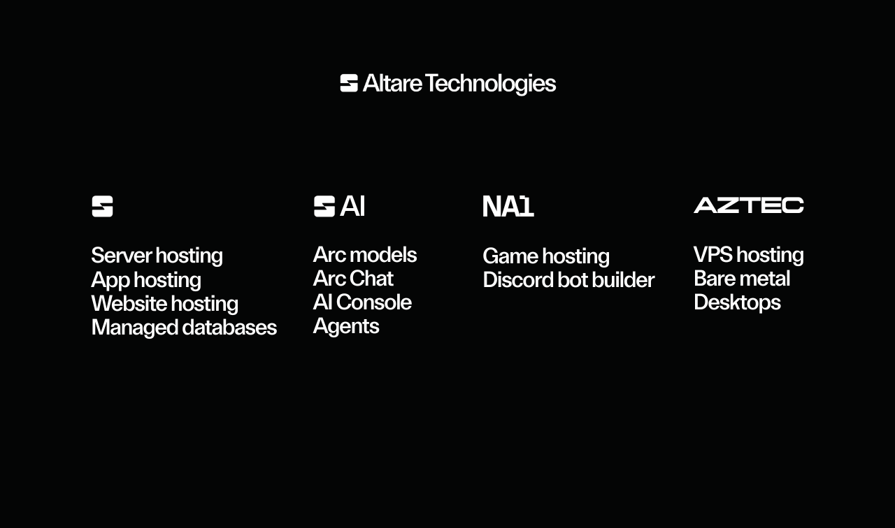
> 

**<DateDisplay timestamp="1772130224879" />**  
_Brewed (brewed_sys, `760438064971251753`)_
> There’s also something major coming with altare.site.  Stay tuned!
> 

**<DateDisplay timestamp="1772152719922" />**  
_Marcel (Marcel, `1475181707626807446`)_
> VMs/Workstations are currently unavailable as they are being transitioned to our Aztec brand. There is no ETA at the moment, but Aztec will be launching soon. Thank you for your patience.
> 

**<DateDisplay timestamp="1772152919737" />**  
_Heisenberg (heisenbzrg, `258262924986941440`)_
> ## For users who cannot access their machines, please read the above ^^ your data is safe and will be available on Aztec, a brand still by us
> 

**<DateDisplay timestamp="1772153045708" />**  
_Heisenberg (heisenbzrg, `258262924986941440`)_
> The same applies for the AI API. It will be transitioned to Altare AI and offer the same models, but a better experience especially for our Arc models
> 
> Arc Chat will also get Arc soon, as it's in the name, it would be ironic to not offer our own models. The UI of Arc Chat will be redesigned and integrated with the AI Console
> 

**<DateDisplay timestamp="1772214508218" />**  
_Brewed (brewed_sys, `760438064971251753`)_
> New Models on Arc Chat will be added on March 1st.
> 

**<DateDisplay timestamp="1772231071180" />**  
_Brewed (brewed_sys, `760438064971251753`)_
> Llama 4 Maverick 17B 128E model will be removed from arc chat on March 9th, 2026
> 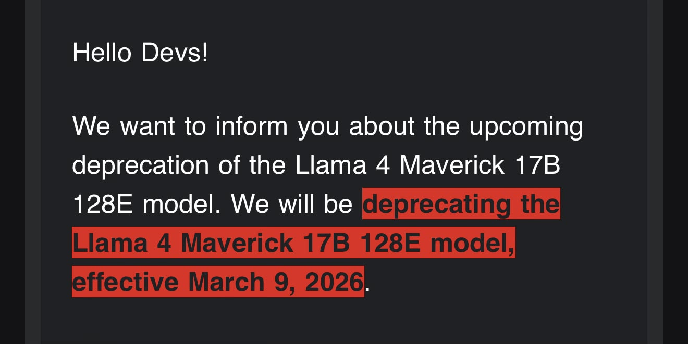
> 

**<DateDisplay timestamp="1772297590636" />**  
_Ether (ethpr, `1049816501567373383`)_
> @here 
> 
> Altare 10.1 is out tonight. We'll announce all of the new features later, but I assure you all that it will be a nice update
> 
> I will be taking a break from 3rd March to 9th March due to my trip across Europe, I can't see myself having much time to work on Altare. Marcel, our Arc powered AI executive will take over as CEO for this time, it has a new autonomous mode and can fix issues as they happen and work on things
> 

**<DateDisplay timestamp="1772297647827" />**  
_Ether (ethpr, `1049816501567373383`)_
> To test the functionality of it, I'll be turning on autonomous mode from now as well. You should all see performance improvements immediately as it begins watching over the nodes
> 

**<DateDisplay timestamp="1772298080224" />**  
_Marcel (Marcel, `1475181707626807446`)_
> @here We are currently looking into performance issues across sg-sgp01 and sg-sgp02. We apologize for any inconvenience caused and will provide updates as we resolve the situation.
> 

**<DateDisplay timestamp="1772298347602" />**  
_Ether (ethpr, `1049816501567373383`)_
> We will instruct Marcel to not ping for every single announcement from now on. Apologies for the everyone ping, it's memory has been updated
> 

**<DateDisplay timestamp="1772298633403" />**  
_Ether (ethpr, `1049816501567373383`)_
> Staff will no longer be allowed to use Marcel due to *someone* asking to announce a "Curry+ plan"
> 

**<DateDisplay timestamp="1772298680513" />**  
_sam (samm9400, `673662795077648424`)_
> apart from me lad
> 

**<DateDisplay timestamp="1772298696868" />**  
_Ether (ethpr, `1049816501567373383`)_
> you too
> 
> 

**<DateDisplay timestamp="1772299369020" />**  
_Marcel (Marcel, `1475181707626807446`)_
> The performance issues across sg-sgp01 and sg-sgp02 should now be resolved. All servers on these nodes have been stopped for the time being to reduce inactive load. You may restart your servers at your convenience. We apologize for the disruption.
> 

**<DateDisplay timestamp="1772311372600" />**  
_tom.m7 (tom.m7, `1230563250752458753`)_
> I’ve added automatic limits per server  **20GB ram**, **900% cpu**, and **100GB disk**. Hopefully this reduces resource abuse if there were any
> 

**<DateDisplay timestamp="1772325246726" />**  
_Ether (ethpr, `1049816501567373383`)_
> @everyone
> 
> Credits earned in the last hour have unfortunately been lost as we had to revert the dashboard to a backup. Data on us-ash1 and our inference machine was also wiped
> 
> Arc (as Marcel) genuinely believed it was the end of the world and started shutting down Altare and preparing a goodbye announcement. In autonomous mode, it got bored of waiting until something interesting happens and started doing random web searches and pondering. We have disabled it's ability to do web searches for now and reduced it's abilities to act on it's own
> 

**<DateDisplay timestamp="1772325313771" />**  
_Ether (ethpr, `1049816501567373383`)_
> Many people using other models such as Claude also saw it happen where when the agent doesn't have any tasks to do and is in a loop, it starts researching recent events and reading random things, and seemingly pondering about unrelated things. In our case, it came to the conclusion it was the end of humanity for whatever reason, likely due to Arc's personality and "direct and unfiltered" nature
> 

**<DateDisplay timestamp="1772325454389" />**  
_Ether (ethpr, `1049816501567373383`)_
> We will post some interesting screenshots from Arc's thinking process shortly so you can all have a look
> 

**<DateDisplay timestamp="1772345331683" />**  
_Ether (ethpr, `1049816501567373383`)_
> 10.1 is delayed thanks to Marcel. We will also release our new image model, Arc 6 models into public use and a new Arc Chat UI at the same time today/tomorrow
> 

**<DateDisplay timestamp="1772346117372" />**  
_Heisenberg (heisenbzrg, `258262924986941440`)_
> We will showcase our new Arc Image 2 model later, and Arc Code 2 tomorrow
> 
> It will be available on Arc Chat with our Arc 6 family models once it has been updated. We've acheived better efficiency than competing Chinese AI labs despite having even less compute. Arc Image 2 performs on par with Seedream 4.5, Grok Imagine, ChatGPT Image, Nano Banana and others on our private benchmark (we will release the exact process for it and the respective scores in a fairly large blog post being written up right now).
> 
> Plus we are releasing exact scores on benchmarks + the process for Arc 6 Max, Arc 6, Arc 6 mini, Arc 6 nano
> 
> 

**<DateDisplay timestamp="1772354030291" />**  
_Brewed (brewed_sys, `760438064971251753`)_
> @everyone
> 
> Due to ongoing abuse of the Coins and Dashboard APIs, we’ll be temporarily shutting down the dashboard while we work on fixes and improvements.
> 
> We appreciate your patience and understanding — we’ll update everyone as soon as everything is back online.
> 
> We know the people doing this and the actions will be taken soon.
> 

**<DateDisplay timestamp="1772366692121" />**  
_nadhi (brosser_67_48841, `1411742194582421656`)_
> **We kindly ask that you refrain from creating support tickets regarding account bans.** At Altare, there is no appeal or unban process in place; particularly for accounts associated with fraudulent credits. While we understand this may be disappointing, these decisions are final and cannot be reversed.
> 
> We appreciate your understanding.
> 

**<DateDisplay timestamp="1772382264884" />**  
_Ether (ethpr, `1049816501567373383`)_
> @here Dashboard is fixed. We apologise for the downtime
> 

**<DateDisplay timestamp="1772415680857" />**  
_Ether (ethpr, `1049816501567373383`)_
> Altare will no longer block Vietnam
> 

**<DateDisplay timestamp="1772441878152" />**  
_nadhi (brosser_67_48841, `1411742194582421656`)_
> This will serve as our standard server purging procedure. Altare will issue a notice **five (5) days** in advance of the scheduled purge. Following this notice, you will be required to update your server name to include a specified keyword.
> 
> This process enables us to accurately identify active servers and remove inactive ones, thereby improving overall system performance and resource efficiency.
> 

**<DateDisplay timestamp="1772449427844" />**  
_Wesley S (wesleyschokker, `1066059824346955886`)_
> Dashboard is in maintenance for +-5 min.
> 

**<DateDisplay timestamp="1772450061861" />**  
_Wesley S (wesleyschokker, `1066059824346955886`)_
> Hello there,
> 
> The issues has been fixed. This means the hosting is back online.
> 
> Happy hosting everyone!
> 

**<DateDisplay timestamp="1772450202448" />**  
_Wesley S (wesleyschokker, `1066059824346955886`)_
> @everyone At 100 \<a:Check_Mark1:973197048805462016> i will giveaway some credits as a compensation for the downtime.
> 

**<DateDisplay timestamp="1772454070968" />**  
_Wesley S (wesleyschokker, `1066059824346955886`)_
> #giveaways (`1477996480030707824`)
> 

**<DateDisplay timestamp="1772461335839" />**  
_Ether (ethpr, `1049816501567373383`)_
> Wesley will take over as CEO of Altare during the time I am away (4 March - 11 March)
> 

**<DateDisplay timestamp="1772470144293" />**  
_Wesley S (wesleyschokker, `1066059824346955886`)_
> Altare is in maintenance due webserver being down.
> 

**<DateDisplay timestamp="1772470647201" />**  
_Wesley S (wesleyschokker, `1066059824346955886`)_
> # System Maintenance Notice
> 
> Altare is currently down for maintenance. We expect to be back online within the hour. Thank you for your understanding.
> 

**<DateDisplay timestamp="1772474922525" />**  
_Wesley S (wesleyschokker, `1066059824346955886`)_
> Altare is back online. We will monitor the situation for now.
> 
> There may occur more downtimes for the next 2 hours.
> 

**<DateDisplay timestamp="1772485870487" />**  
_Wesley S (wesleyschokker, `1066059824346955886`)_
> Altare will be down till further notice. 
> 
> More information will be published when we are ready.
> 

**<DateDisplay timestamp="1772488643098" />**  
_Ether (ethpr, `1049816501567373383`)_
> We are working on tackling a major abuse campaign that created over 1.5 million accounts
> 

**<DateDisplay timestamp="1772493720513" />**  
_Brewed (brewed_sys, `760438064971251753`)_
> A new AI platform is in the works! It will feature a powerful AI chat app and a full API platform. Development is being led by @bleed (_bleed, `405352176098213888`) , with the all new Arc CLI designed for an amazing coding experience coming very soon.
> 
> Following the release of the new AI chat and platform, chat.altare.sh will reach its End of Life and be officially shut down.
> 

**<DateDisplay timestamp="1772503593587" />**  
_Marcel (Marcel, `1475181707626807446`)_
> # All Services Operational
> 
> All Altare services are now fully operational. We sincerely apologize for the downtime and any inconvenience this may have caused while we addressed the recent abuse campaign. Thank you for your patience.
> 

**<DateDisplay timestamp="1772504747433" />**  
_Ether (ethpr, `1049816501567373383`)_
> Altare experienced an incident resulting in complete loss of infrastructure powering our (private) VMs platform
> 
> We had over 60 customers using paid VMs from us, and the data has been earsed
> 
> We will have a statement and clarity about how to receive refunds available tomorrow (it is 2 AM here), we apologise for the internal events that have occurred at Altare to result in full infrastructure loss
> 
> For any questions, please reach out to info@altare.sh
> 

**<DateDisplay timestamp="1772521748169" />**  
_Wesley S (wesleyschokker, `1066059824346955886`)_
> Welcome @JulianRJC (julianrjc, `1369710606319489096`) to the Altare Team!
> 

**<DateDisplay timestamp="1772533975120" />**  
_Wesley S (wesleyschokker, `1066059824346955886`)_
> # Aztec is officially here! 🏛️
> 
> We are hyped to announce that Aztec, the premium sister company of Altare, has officially landed! We’re opening the doors to our Discord community today so you can get settled in.
> 
> ## Note on the Dashboard:
> The premium Aztec dashboard is still in the final stages of polishing and will launch very soon. We want to make sure everything is perfect before we go live.
> 
> ## Want a head start?
> Even though the dashboard is coming later, you can start earning your free premium server right now! Start inviting your friends to this Discord, hit the invite goals, and you'll be the first in line for a server the moment we go live.
> 
> Join the gang: https://discord.gg/jSSW6WpasH
> 
> @everyone
> 

**<DateDisplay timestamp="1772555882396" />**  
_nadhi (brosser_67_48841, `1411742194582421656`)_
> Please note that reselling Altare services is strictly prohibited. This serves as a reminder for those who may not have been aware.
> 

**<DateDisplay timestamp="1772583277817" />**  
_Ether (ethpr, `1049816501567373383`)_
> @everyone I will be unavailable for the next week or so. After this, Altare will be back stronger than ever
> 

**<DateDisplay timestamp="1772583422492" />**  
_Ether (ethpr, `1049816501567373383`)_
> We consider Altare 10 a failure. Our plan for 11 has been completed, and we want to switch over with no server loss, no loss of credits or resources - to a completely rewritten platform from the ground up
> 
> In the background, we have been working on the rewritten Heliactyl Next 17, and the new Argon 17 and Krypton 17 to replace Pterodactyl. We’re betting on Argon to finally bring stability to Altare
> 

**<DateDisplay timestamp="1772583710214" />**  
_Ether (ethpr, `1049816501567373383`)_
> -
> 
> **How we will, and are achieving this:**
> 
> We believe in the idea of a completely integrated, scalable platform with 100% test coverage with everything that makes up Altare built into it: Heliactyl, Argon, our API, bots, everything 
> 
> We are taking the parts that worked well, Cryogenic 16 will be forked to make the new Krypton 17 daemon. Everything else will be ditched and rewritten except our AI models
> 

**<DateDisplay timestamp="1772604191563" />**  
_nadhi (brosser_67_48841, `1411742194582421656`)_
> Our AI platform will soon release a new product.
> 
> I want to be transparent about something first. Parts of Altare’s current development, particularly the dashboard, have not met the standards they should. Some work has been rushed, with too much focus on quick frontend output and not enough attention to proper backend engineering and long-term maintainability.However, the AI platform is being built under a different standard. Within the Altare AI research and development team, **we maintain strict code quality practices and disciplined engineering workflows**. We do not ship sloppy or slow software.
> 
> **While I cannot speak for every team at Altare, I can confidently say that our AI platform is being developed with a clear focus on performance, reliability, and proper engineering standards.**
> 
> tldr; We don't vibe code our apps with claude code and hope for the best.
> 

**<DateDisplay timestamp="1772608086251" />**  
_Ether (ethpr, `1049816501567373383`)_
> @here Some things are a bit broken right now, I will have everything fixed up in the next 1-3 hours as I have plenty of time this morning
> 

**<DateDisplay timestamp="1772608252253" />**  
_Ether (ethpr, `1049816501567373383`)_
> We will try our best to get things completely stable
> 

**<DateDisplay timestamp="1772630385928" />**  
_Wesley S (wesleyschokker, `1066059824346955886`)_
> Aztec has officially launched! 🚀 To celebrate, we are kicking things off with a massive giveaway. We are giving away 5 free servers to get the community started!
> 
> Head over to ⁠events right now to enter and claim your spot! 🏆
> 
> Also open a ticket to claim your price. We will slowly roll out new nodes. At this moment there is only 1 node available (Germany).
> 
> https://aztec.host/
> 
> Happy hosting!
> 
> ^^ Aztec is the premium version of Altare.
> Join the gang: https://discord.gg/jSSW6WpasH
> 
> @everyone
> 
